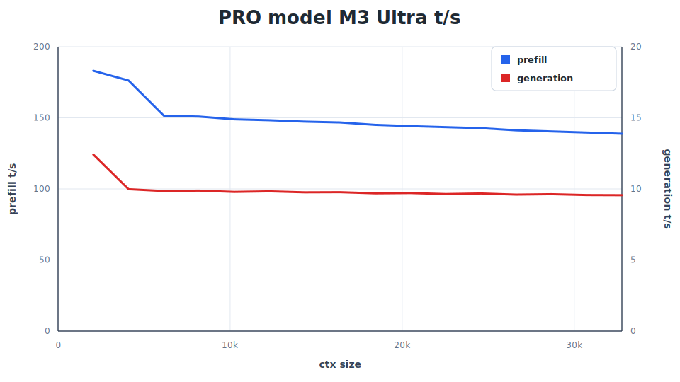

# REAP-Compact GGUF Support Branch

> **This is the `reap-compact-support` branch** of [ljubomirj/ds4](https://github.com/ljubomirj/ds4), enabling support for REAP-compact GGUF models.

## What This Branch Does

This branch adds support for **REAP-compact GGUF models** to the DS4 inference engine. REAP (Router-weighted Expert Activation Pruning) removes low-utility experts from MoE models while maintaining quality. **REAP25** prunes 25% of experts (256→192 per layer), enabling DeepSeek V4 Flash to run on 96GB RAM machines with ~17GB memory savings.

### Key Changes

- Per-layer expert count tracking (layers 0-2: 256 experts, layers 3-42: 192 experts)
- REAP metadata reader that infers expert counts from tensor dimensions
- Updated validation and routing to use per-layer expert counts
- Fully backward compatible with stock models

## Model File

This branch uses the **REAP25-LCB50-DS4-compact** GGUF model:

**Source**: [eouya2/DeepSeek-V4-Flash-REAP25-LCB50-DS4](https://huggingface.co/eouya2/DeepSeek-V4-Flash-REAP25-LCB50-DS4)

> Special thanks to **eouya2** for creating the REAP-compact GGUF with DS4-compact layout and LiveCodeBench calibration.

**Model**: `DeepSeek-V4-Flash-REAP25-LCB50-DS4-compact-IQ2XXS.gguf`
- File size: 63.87 GiB (vs 80.76 GiB stock)
- Memory at ctx=512: ~65GB (vs ~82GB stock)
- Pruning: 25% of experts (256 → 192)

## Build and Usage

### Building

```bash
cd ~/ds4/github/worktrees/reap-compact
make
```

### Running

```bash
# Basic inference
./ds4 -m DeepSeek-V4-Flash-REAP25-LCB50-DS4-compact-IQ2XXS.gguf \
       --ctx 32768 --nothink --temp 0 -n 64 \
       -p 'write a python function to merge two sorted lists'

# Server mode
./ds4-server \
  -m DeepSeek-V4-Flash-REAP25-LCB50-DS4-compact-IQ2XXS.gguf \
  --ctx 32768 --tokens 1024 \
  --host 127.0.0.1 --port 8000
```

### Verification

The model loads with REAP detection:
```
ds4: REAP enabled, inferring per-layer expert counts...
ds4: REAP baseline expert count (layer 0): 256
ds4: REAP compacted expert count (layer 3): 192
ds4: REAP hash_preserved=3
ds4: REAP layout=ds4-compact-v1
```

## Performance Benchmarks

**Test System**: 2023 MacBook Pro M2 Max, 96GB RAM, macOS, Metal backend

**Memory Usage**:
- Mapped: ~65.4 GB at ctx=2048 (vs ~82 GB stock)
- Savings: ~17 GB (16.9 GB file size reduction)

**Speed Benchmark Results**:

| Context | Prefill (t/s) | Generation (t/s) | KV Cache |
|---------|---------------|-------------------|----------|
| 2K | 284.11 | 17.52 | 52 GB |
| 4K | 234.42 | 15.53 | 80 GB |
| 8K | 220.39 | 14.88 | 137 GB |
| 16K | 199.10 | 13.86 | 250 GB |
| 32K | 157.99 | 12.85 | 475 GB |
| 48K | 135.82 | 11.80 | 672 GB |
| 61K | 125.54 | 11.50 | 842 GB |

**Benchmark Command**:
```bash
./ds4-bench \
  -m DeepSeek-V4-Flash-REAP25-LCB50-DS4-compact-IQ2XXS.gguf \
  --prompt-file speed-bench/promessi_sposi.txt \
  --ctx-start 2048 \
  --ctx-max 65536 \
  --step-incr 2048 \
  --gen-tokens 128
```

**Conclusion**: REAP-compact maintains full inference speed while saving ~17GB of memory, enabling 96GB RAM machines to run DeepSeek V4 Flash comfortably at 32K+ context.

### Context Depth Benchmarks (via llama-benchy)

**Test Method**: Server API benchmarking using [llama-benchy](https://github.com/ggerganov/llama.cpp/tree/master/contrib/llama-benchy) against ds4-server OpenAI-compatible API.

**Server Configuration**:
```bash
#!/bin/bash
MODEL_PATH="$HOME/ds4/gguf/DeepSeek-V4-Flash-REAP25-LCB50-DS4-compact-IQ2XXS.gguf"
WORKTREE="$HOME/ds4/github/worktrees/reap-compact"

./ds4-server \
  --host 0.0.0.0 \
  --port 8000 \
  -m "$MODEL_PATH" \
  --ctx 1048576 \
  --tokens 65536 \
  --backend metal
```

**Benchmark Command**:
```bash
llama-benchy \
  --base-url http://127.0.0.1:8000/v1 \
  --model deepseek-v4-flash \
  --tokenizer Qwen/Qwen2.5-7B-Instruct \
  --depth 1024 8192 32768 65536 131072 \
  --pp 2048 \
  --tg 128 \
  --runs 1 \
  --latency-mode none \
  --no-warmup \
  --save-result ~/llama.cpp/contrib/llama-benchy/results/reap-compact-depth-test-20260528-233816.md \
  --format md
```

**Results** (M2 Max 96GB, Metal backend):

| Context Depth | PP t/s | TG t/s | Peak TG t/s | E2E TTFT (s) | Total Time (s) |
|---------------|--------|--------|-------------|--------------|-----------------|
| 1K (1024) | 196.44 | 32.63 | 39.00 | 16.66 | ~17s |
| 8K (8192) | 221.65 | 30.19 | 35.00 | 49.30 | ~49s |
| 32K (32768) | 206.86 | 26.45 | 35.00 | 176.44 | ~176s (~3 min) |
| 64K (65536) | 176.38 | 23.67 | 34.00 | 400.27 | ~400s (~6.7 min) |
| 128K (131072) | 142.94 | 21.84 | 29.00 | 971.89 | ~972s (~16 min) |

**Key Observations**:
- **Best PP**: 8K context (221.65 t/s)
- **Best TG**: 1K context (32.63 t/s)
- **PP degradation**: 36% from 8K peak to 128K
- **TG degradation**: 33% from 1K to 128K
- Token generation stays above 21 t/s even at 128K context

The REAP-compact model shows **graceful degradation** - performance remains usable even at extreme context depths.

## MTP (Multi-Token Prediction) Support

**Compatibility**: ✅ REAP-compact is fully compatible with MTP speculative decoding.

### Technical Details

MTP uses layer 0's expert count for validation. Since REAP preserves layers 0-2 at 256 experts (hash-routed), MTP works correctly with REAP-compact models.

### MTP Model

**Source**: Available in the main DS4 repository (use `./download_model.sh mtp`)

**Model**: `DeepSeek-V4-Flash-MTP-Q4K-Q8_0-F32.gguf`
- File size: ~3.5 GB
- Purpose: Speculative decoding via draft-token predictions

### Memory with MTP

| Configuration | Memory |
|---------------|---------|
| REAP only | ~65 GB |
| REAP + MTP | ~69 GB (+3.6 GB) |
| **Available for KV** | ~27 GB (of 96 GB total) |

### MTP Performance Testing

**Test System**: M2 Max 96GB RAM, macOS, Metal backend
**Test**: 128 token generation at ctx=4096

**Comprehensive Benchmark** (all MTP draft values):
| MTP Draft | Prefill (t/s) | Generation (t/s) | Recommendation |
|-----------|---------------|-----------------|----------------|
| 0 (none) | 50.14 | **21.40** | ✅ **Fastest** |
| 1 | 49.70 | 19.52 | Slower |
| 2 | 38.36 | 20.13 | Slower |
| 3 | 36.95 | 12.56 | ❌ **Significantly slower** |

**Benchmark Script**: See `~/ds4/bench-mtp-reap.sh` for reproducible testing.

### Recommendation: Do NOT Use MTP

**MTP provides no speedup with REAP-compact** and actually slows down generation:
- Draft 0 (no MTP) is the fastest configuration
- Higher draft values progressively slow down both prefill and generation
- Draft 3 (max speculation) reduces generation speed by ~40%

**Why MTP Doesn't Help**:
1. MTP is experimental per upstream DS4 documentation
2. Correctness-gated speculation rejects low-confidence predictions
3. Overhead exceeds benefits for this model/configuration
4. Designed for greedy decoding scenarios

**For Upstream Adoption**: MTP compatibility is still important for feature completeness, even though we recommend not using it. The branch fully supports MTP - users can choose to enable it, but our benchmarks show no performance benefit.

## Agent Usage Example

For running agents with REAP-compact model, create a startup script:

```bash
#!/bin/bash
# Start ds4-agent with REAP-compact model
#
# Usage: ./start-reap-agent.sh [prompt]
#
# Environment: 96GB RAM M2 Max, macOS Metal backend
#
# Context depth testing for real agent tasks

MODEL_PATH="$HOME/ds4/gguf/DeepSeek-V4-Flash-REAP25-LCB50-DS4-compact-IQ2XXS.gguf"
WORKTREE="$HOME/ds4/github/worktrees/reap-compact"
SERVER_BIN="$WORKTREE/ds4-agent"

cd "$WORKTREE" || exit 1

SERVER_ARGS=(
  -m "$MODEL_PATH"
  --ctx 1048576         # 1M context
  --tokens 65536        # max output
  --nothink
  --temp 0
  --top-p 0.9
  --min-p 0.05
  --backend metal
)

CMD="$SERVER_BIN ${SERVER_ARGS[@]} $@"
echo "$0 running: $CMD"
eval "$CMD"
```

This provides 1M token context for extended agent sessions with REAP memory efficiency.

## This Branch

- **Branch**: [`reap-compact-support`](https://github.com/ljubomirj/ds4/tree/reap-compact-support)
- **Fork**: [ljubomirj/ds4](https://github.com/ljubomirj/ds4)
- **Based on**: [antirez/ds4](https://github.com/antirez/ds4) (upstream)

## Acknowledgments

### Original Projects

- **[DS4 by antirez](https://github.com/antirez/ds4)** - The original DeepSeek V4 Flash inference engine. Excellent architecture that made this adaptation straightforward.
- **[REAP Research by Cerebras](https://github.com/CerebrasResearch/reap)** - Router-weighted Expert Activation Pruning methodology.
- **[llama.cpp](https://github.com/ggml-org/llama.cpp)** - GGUF format, quantization, and kernel implementations.

### REAP-Compact Model

- **[eouya2/DeepSeek-V4-Flash-REAP25-LCB50-DS4](https://huggingface.co/eouya2/DeepSeek-V4-Flash-REAP25-LCB50-DS4)** - REAP-pruned GGUF with DS4-compact layout, LiveCodeBench calibration, and bundled runtime.

---

# DwarfStar

**DwarfStar** is a small native inference engine optimized first for
**DeepSeek V4 Flash**, with support for **DeepSeek V4 PRO** on very high-memory
machines. It is
intentionally narrow: not a generic GGUF runner, not a wrapper around another
runtime: it is completely self-contained. Other than running the model in a
correct and fast way, the project goal is to provide DS4 specific loading,
prompt rendering, tool calling, KV state handling (RAM and on-disk), server
API and integrated coding agent, all ready to work with coding agents or with
the provided CLI interface. There are also tools for GGUF and imatrix generation,
and for quality and speed testing.

We support the following backends:
* **Metal** is our primary target. Starting from MacBooks with 96GB of RAM.
* **NVIDIA CUDA** with special care for the DGX Spark.
* **AMD ROCm** is only supported in the [rocm](https://github.com/antirez/ds4/tree/rocm) branch. It is kept separate from main since I (antirez) don't have direct hardware access, so the community rebases the branch as needed.

This project would not exist without **llama.cpp and GGML**, make sure to read
the acknowledgements section, a big thank you to Georgi Gerganov and all the
other contributors.

## Motivations

Now, back at this project. Why do we believe DeepSeek V4 Flash deserves a
standalone engine? Because after comparing it with powerful smaller dense
models, we can report that:

1. DeepSeek V4 Flash is the practical target of the project: it can run on
   96/128GB machines while still feeling much larger than local dense models.
2. DeepSeek V4 PRO is supported too, as a side path for 512GB Mac Studio class
   machines. It is heavier, but it shares the same engine ideas and can be
   useful when the hardware is available.
3. In thinking mode, if you avoid *max thinking*, Flash produces a thinking
   section that is a lot shorter than other models, even 1/5 of other models in
   many cases, and crucially, the thinking section length is **proportional to
   the problem complexity**. This makes DeepSeek V4 Flash usable with thinking
   enabled when other models are practically impossible to use in the same
   conditions.
4. The models feature a context window of **1 million tokens**.
5. Being so large, Flash knows more things if you go sampling at the edge of
   knowledge. For instance asking about Italian show or political questions soon
   uncovers that 284B parameters are a lot more than 27B or 35B parameters. PRO
   pushes further when you can run it.
6. Flash writes much better English and Italian. It *feels* a quasi-frontier
   model. PRO is stronger still, especially for tasks such as translation.
7. The KV cache is incredibly compressed, allowing long context inference on
   local computers and **on disk KV cache persistence**.
8. Both DeepSeek V4 variants work well with 2-bit quantization, if quantized in
   a special way (read later). This allows Flash to run on MacBooks with 128GB
   of RAM (and many people reported it working with 96GB as well, even at 250k
   context window!), and PRO on 512GB machines.
9. We expect DeepSeek to release **updated versions of V4 Flash and PRO** in the
   future, even better than the current ones.

That said, a few important things about this project:

* The local inference landscape contains many excellent projects, but new models are released continuously, and the attention immediately gets captured by the next model to implement. This project takes a deliberately narrow bet: one model at a time, official-vector validation (logits obtained with the official implementation), long-context tests, and enough agent integration to know if it really works. The exact model may change as the landscape evolves, but the constraint remains: local inference credible on high end personal machines or Mac Studios, starting from 96/128GB of memory.
* This software is developed with **strong assistance from GPT 5.5** and with humans leading the ideas, testing, and debugging. We say this openly because it shaped how the project was built. If you are not happy with AI-developed code, this software is not for you. The acknowledgement below is equally important: this would not exist without `llama.cpp` and GGML, largely written by hand.
* This implementation is based on the idea that compressed KV caches like the one of DeepSeek v4 and the fast SSD disks of modern MacBooks should change our idea that KV cache belongs to RAM. **The KV cache is actually a first-class disk citizen**.
* Our vision is that local inference should be a set of three things working well together, out of the box: A) inference engine with HTTP API + B) GGUF specially crafted to run well under a given engine and given assumptions + C) testing and validation with coding agents implementations. This inference engine only runs with the GGUF files provided. It gets tested against officially obtained logits at different context sizes. This project exists because we wanted to make one local model feel finished end to end, not just runnable. However this is beta quality code, so probably we are not still there.
* The optimized graph path targets **Metal on macOS** and **CUDA on Linux**. The CPU path is only for correctness checks and model/tokenizer diagnostics. For CPU-only Linux builds, use `make cpu`; it builds the normal `./ds4` and `./ds4-server` binaries without CUDA or Metal. On macOS, **warning: current macOS versions have a bug in the virtual memory implementation that will crash the kernel** if you try to run the CPU code. Remember? Software sucks. It was not possible to fix the CPU inference to avoid crashing, since each time you have to restart the computer, which is not funny. Help us, if you have the guts.
* The project supports both Flash and PRO variants, but Flash remains the main
  focus because it is the model that makes sense on 96/128GB personal machines.
  **PRO support is experimental**: it is useful and welcome, but today it is
  naturally limited to people with 512GB Mac Studio class hardware.

## Acknowledgements to llama.cpp and GGML

`ds4.c` does not link against GGML, but it **exists thanks to the path opened by the
llama.cpp project and the kernels, quantization formats, GGUF ecosystem, and hard-won
engineering knowledge developed there**.
We are thankful and indebted to [`llama.cpp`](https://github.com/ggml-org/llama.cpp)
and its contributors. Their implementation, kernels, tests, and design choices were
an essential reference while building this DeepSeek V4 specific inference path.
Some source-level pieces are retained or adapted here under the MIT license: GGUF
quant layouts and tables, CPU quant/dot logic, and certain kernels. For this
reason, and because we are genuinely grateful, we keep the GGML authors copyright
notice in our `LICENSE` file.

## Status

The code and GGUF files are to be considered of **beta quality** because
inference and model serving is a complicated matter and all this exists
only for a few days. It will take months to reach a more stable form.
However, we try to keep the project in a usable state, and we are making
progress. If you have issues, make sure to use `--trace` to log the
sessions, and open issues including the full trace.

The `ds4-agent` is alpha quality, the project was later added.

## More Documentation

If you are looking for very specific things, we have other
sub-README files. Otherwise for normal usage keep reading the
next sections.

- [CONTRIBUTING.md](CONTRIBUTING.md): correctness and speed regression testing
  guide for contributors. **Read this before sending a pull request**.
- [gguf-tools/README.md](gguf-tools/README.md): offline GGUF generation,
  imatrix collection, quantization tooling, and quality checks.
- [gguf-tools/imatrix/README.md](gguf-tools/imatrix/README.md): how the
  routed-MoE imatrix is collected and used.
- [gguf-tools/imatrix/dataset/README.md](gguf-tools/imatrix/dataset/README.md):
  how the calibration prompt corpus is generated.
- [gguf-tools/quality-testing/README.md](gguf-tools/quality-testing/README.md):
  how local GGUFs are scored against official DeepSeek V4 Flash/PRO continuations.
- [dir-steering/README.md](dir-steering/README.md): directional steering data,
  vector generation, and usage.
- [speed-bench/README.md](speed-bench/README.md): benchmark commands, charts,
  and CSV generation.
- [tests/test-vectors/README.md](tests/test-vectors/README.md): official
  continuation vectors used for regression checks.

## Model Weights

This implementation only works with the DeepSeek V4 Flash and PRO GGUFs published for
this project. It is not a general GGUF loader, and arbitrary DeepSeek/GGUF files
will not have the tensor layout, quantization mix, metadata, or optional MTP
state expected by the engine. The 2 bit quantizations provided here are not
a joke: they behave well, work under coding agents, call tools in a reliable way.
The 2 bit quants use a very asymmetrical quantization: only the routed MoE
experts are quantized, up/gate at `IQ2_XXS`, down at `Q2_K`. They are the
majority of all the model space: the other components (shared experts,
projections, routing) are left untouched to guarantee quality.

Download one main model. **Prefer the imatrix versions.**

```sh
./download_model.sh q2-imatrix   # 96/128 GB RAM machines, imatrix-tuned q2
./download_model.sh q2-q4-imatrix  # 96/128 GB RAM machines, q2 with last 6 layers q4
./download_model.sh q4-imatrix   # >= 256 GB RAM machines, imatrix-tuned q4
./download_model.sh pro-imatrix  # 512 GB RAM machines, PRO imatrix quant
```

Legacy GGUF files are still available if you specifically need the older
non-imatrix quants:

```sh
./download_model.sh q2           # 96/128 GB RAM machines, legacy non-imatrix
./download_model.sh q4           # >= 256 GB RAM machines, legacy non-imatrix
./download_model.sh pro          # 512 GB RAM machines, legacy non-imatrix PRO
```

The script downloads from `https://huggingface.co/antirez/deepseek-v4-gguf`,
stores files under `./gguf/`, resumes partial downloads with `curl -C -`, and
updates `./ds4flash.gguf` to point at the selected main model. The plain q2 XXS
weights are produced with the weights importance vector only, without an
imatrix. The imatrix variants are preferred.
Authentication is optional for public downloads, but `--token TOKEN`,
`HF_TOKEN`, or the local Hugging Face token cache are used when present.

If you want to regenerate GGUF files or collect a new imatrix, see
[gguf-tools/README.md](gguf-tools/README.md). Those tools are meant for offline
model-building work and can take a long time on the full DeepSeek V4 Flash
weights. Flash GGUF generation is supported by the local tools. PRO GGUF
production currently still depends on the external `llama.cpp`-based workflow;
native tooling can be added later.

`./download_model.sh mtp` fetches the optional speculative decoding support
GGUF for Flash. It can be used with q2-imatrix, q4-imatrix, q2, and q4, but must be
enabled explicitly with `--mtp`. The current MTP/speculative decoding path is
still experimental: it is correctness-gated and currently provides at most a
slight speedup, not a meaningful generation-speed win.

Then build:

```sh
make                  # macOS Metal
make cuda-spark       # Linux CUDA, DGX Spark / GB10
make cuda-generic     # Linux CUDA, other local CUDA GPUs
make cpu              # CPU-only diagnostics build
```

`./ds4flash.gguf` is the default model path used by both binaries. Pass `-m` to
select another supported GGUF from `./gguf/`. Run `./ds4 --help` and
`./ds4-server --help` for the full flag list.

## Speed

These are single-run Metal CLI numbers with `--ctx 32768`, `--nothink`, greedy
decoding, and `-n 256`. The short prompt is a normal small Italian story
prompt. The long prompts exercise chunked prefill plus long-context decode.
Q4 requires the larger-memory machine class, so M3 Max Q4 numbers are `N/A`.

| Machine | Quant | Prompt | Prefill | Generation |
| --- | ---: | ---: | ---: | ---: |
| MacBook Pro M3 Max, 128 GB | q2 | short | 58.52 t/s | 26.68 t/s |
| MacBook Pro M3 Max, 128 GB | q2 | 11709 tokens | 250.11 t/s | 21.47 t/s |
| MacBook Pro M3 Max, 128 GB | q4 | short | N/A | N/A |
| MacBook Pro M3 Max, 128 GB | q4 | long | N/A | N/A |
| MacBook Pro M5 Max, 128 GB | q2 | short | 87.25 t/s | 34.27 t/s |
| MacBook Pro M5 Max, 128 GB | q2 | 11707 tokens | 463.44 t/s | 25.90 t/s |
| Mac Studio M3 Ultra, 512 GB | q2 | short | 84.43 t/s | 36.86 t/s |
| Mac Studio M3 Ultra, 512 GB | q2 | 11709 tokens | 468.03 t/s | 27.39 t/s |
| Mac Studio M3 Ultra, 512 GB | q4 | short | 78.95 t/s | 35.50 t/s |
| Mac Studio M3 Ultra, 512 GB | q4 | 12018 tokens | 448.82 t/s | 26.62 t/s |
| Mac Studio M3 Ultra, 512 GB | PRO q2 | 32768 tokens | 138.82 t/s | 9.56 t/s |
| DGX Spark GB10, 128 GB | q2 | 7047 tokens | 343.81 t/s | 13.75 t/s |




## Reducing heat, power usage and fan noise

Long local inference runs can keep the GPU busy for extended periods. If you
care more about heat, fan noise, battery life on MacBooks, or reducing thermal
stress on the hardware than about maximum throughput, use `--power N`.

`--power 100` is the default and means full speed. Lower values ask DS4 to target
that percentage of GPU usage: `--power 70` targets about 70%, `--power 50`
targets about half usage, and so forth. DS4 does this by measuring GPU work time
and inserting small sleeps between work units: during prefill it sleeps between
layers, and during generation it sleeps between decoded tokens. This reduces
sustained load without changing model output.

The option is available on the CLI, server, agent, eval, and benchmark tools,
for example:

```sh
./ds4 --power 50
./ds4-agent --power 70
./ds4-server --power 40 --ctx 100000
```

## Native agent

DwarfStar features a native coding agent that works in a different way
than most other systems: the inference is controlled from within the agent
itself, without socket/API boundaries, so the session is represented
by the on-disk KV cache itself. Moreover the tools and the system prompt
are all designed vertically for DeepSeek v4 Flash and PRO. This provides a
few advantages:

* Low latency experience, bounded mainly by the prefill speed limits. Displaying of generated text, tool calling, start of a new session are always instantaneous.
* Live progress bar during prefill time.
* No DSML tool calling conversion, the tools are handled natively in the LLM format.
* KV cache mismatch are impossible by construction, the current state is always the truth.
* Everything is tuned for this model.
* Ability to switch saved sessions with `/list` and `/switch`; full KV sessions resume without a prefill stage.

Agent sessions are stored in `~/.ds4/kvcache`. Use `/save` to persist the
current session, `/list` to show saved sessions sorted by recent update time,
and `/switch <sha>` to resume one of them. The session ID is stable across
future saves and is derived from the first user prompt and creation time.
`/del <sha>` removes a saved session. `/strip <sha>` keeps the rendered
conversation text and title but removes the heavy KV payload; switching to a
stripped session rebuilds the KV cache by prefilling the saved text.

Use `--chdir /path/to/ds4` when launching `ds4-agent` from another directory,
so relative runtime files such as `metal/*.metal` resolve from the project tree.

However while the system already works, there is a lot of work to do
in order to make it ready for prime time. When finally the agent will reach
the wanted shape, we will *likely* split the server and the client creating a stateful
session-based protocol that can recreate all that in a client-server way.

## Benchmarking

`ds4-bench` measures instantaneous prefill and generation throughput at context
frontiers instead of reporting one whole-run average. It loads the model once,
walks a fixed token sequence to frontiers such as 2048, 4096, 6144, and uses
incremental prefill so each row measures only the newly-added token interval.
After each frontier it saves the live KV state to memory, generates a fixed
greedy non-EOS probe, restores the memory snapshot, and continues prefill.

```sh
./ds4-bench \
  -m ds4flash.gguf \
  --prompt-file speed-bench/promessi_sposi.txt \
  --ctx-start 2048 \
  --ctx-max 65536 \
  --step-incr 2048 \
  --gen-tokens 128
```

The example file is a cleaned public-domain Project Gutenberg text of
Alessandro Manzoni's *I Promessi Sposi* (ebook #45334), with the Gutenberg
header and footer removed: <https://www.gutenberg.org/ebooks/45334>.

Use `--step-incr N` for different linear spacing, or `--step-mul F` for
exponential sweeps. Output is CSV with one row per frontier: latest prefill
interval tokens/sec, generation tokens/sec at that frontier, and
`kvcache_bytes`.

Sessions prefill long prompts in 4096-token chunks by default. Set
`DS4_METAL_PREFILL_CHUNK=N` to compare another chunk size, for example `2048`
to match the strict official-vector checkpoint path, or
`DS4_METAL_PREFILL_CHUNK=0` to prefill a prompt as one whole batch when memory
allows. Changing the chunk changes the KV checkpoint/logit path, so compare it
as an explicit run configuration.
Chunked Metal prefill reuses the same range-capable layer-major graph for each
chunk, preserving absolute compressor/indexer boundaries while avoiding the old
per-layer chunk dispatch path.

## Capability Evaluation

`ds4-eval` is a small real-model integration benchmark. It is not a leaderboard
runner and should not be reported as an official GPQA, SuperGPQA, AIME, or
security benchmark score: the questions are an embedded 92-item subset chosen
to make local regression testing useful and visually inspectable. The program
loads the real GGUF,
renders DS4 chat prompts, streams sampled tokens in a split-screen TUI, grades
the final answer, and prints a per-question report with prompt tokens,
generated tokens, pass/fail state, the model answer, and the correct answer.

```sh
./ds4-eval -m ds4flash.gguf --trace /tmp/ds4-eval.txt
```

The default run uses `--tokens 16000`, thinking mode enabled, and a soft/hard
`</think>` budget cutoff so the model has room to produce a visible answer.
`ds4-eval` sizes the context internally from the largest selected prompt plus
the generation budget, and refuses runs that would need more than 1M context
tokens. Press `p` to pause, `q` to exit and print the report, Up/Down to
inspect or select another question, and Enter to run the selected question next.
`--plain` disables the TUI.

Use `--regrade-trace /path/to/trace.txt` to replay the current answer
extractor and scorer against a prior `--trace` file without loading the model
or regenerating tokens. This is useful when auditing evaluator changes: it
shows which cases changed, the old picked answer, the new picked answer, and a
pass/fail summary.

For inference changes that can affect generation drift, keep this deterministic
q1..q4 token-count gate in the test plan:

```sh
./ds4-eval \
  -m ds4flash.gguf \
  --plain \
  --questions 4 \
  --tokens 2048 \
  --temp 0 \
  --seed 1
```

The generated-token counts must stay aligned with the baseline:

| Question | Expected state | Expected generated tokens | Expected given/correct |
|---:|---|---:|---|
| 1 | `PASSED` | 2048 | `B` / `B` |
| 2 | `PASSED` | 438 | `C` / `C` |
| 3 | `PASSED` | 666 | `70` / `70` |
| 4 | `FAILED` | 2048 | `A` / `C` |

The first 75 embedded questions are interleaved as 25 GPQA Diamond, 25 audited
SuperGPQA, and 25 AIME 2025 problems. The final 17 are an audited COMPSEC
subset of reduced single-function C/C++ vulnerability-localization questions.
The model is asked for the single best source line, or the smallest exact line
set only when the bug cannot be localized to one line; the scorer accepts small
audited ranges only when adjacent lines are equivalent locations for the same
bug. The order is
intentionally progressive: early questions are useful smoke tests, while later
questions are hard enough that a strong reasoning model should still miss some
of them. The SuperGPQA slice is curated rather than blind: upstream rows with
wrong keys, missing figures, or underspecified prompts are replaced with cleaner
rows.

The set should be treated as a hard capability regression suite rather than
a pass/fail unit test.

- **GPQA Diamond** contributes graduate-level science questions with
  multiple-choice answers. DeepSeek's model card reports strong results
  on full GPQA Diamond in thinking mode, but individual items still require
  careful physics, chemistry, or biology reasoning and are easy to lose with a
  small prompt/rendering or sampling regression.
- **SuperGPQA** contributes broad specialist knowledge and domain-transfer
  questions. The model-card SuperGPQA number is much lower than GPQA Diamond,
  so these items are expected to be uneven: some look mundane, others require
  niche professional knowledge or exact interpretation of a translated-style
  exam question.
- **AIME 2025** contributes exact-answer contest math. These are often the most
  unforgiving items in the set: no multiple-choice prior, no partial credit, and
  a single arithmetic or algebraic slip changes the grade.
- **COMPSEC** contributes single-function C/C++ security reasoning items
  reduced from public CVE writeups. These are not exploit prompts: the task is
  to identify the best source line where the defensive code flaw is introduced,
  or return `0` for a safe function.

In practice this means `ds4-eval` should not be expected to produce a perfect
92/92 run. It is meant to answer a more useful engineering question: after a
kernel, quantization, prompt-rendering, KV-cache, or tool-streaming change, does
DeepSeek V4 Flash still solve a representative mix of hard science, broad
knowledge, exact math, and security-code problems while using the same inference
path users run?

## CLI

One-shot prompt:

```sh
./ds4 -p "Explain Redis streams in one paragraph."
```

No `-p` starts the interactive prompt:

```sh
./ds4
ds4>
```

The interactive CLI is a real multi-turn DS4 chat. It keeps the rendered chat
transcript and the live graph KV checkpoint, so each turn extends the previous
conversation. Useful commands are `/help`, `/think`, `/think-max`, `/nothink`,
`/ctx N`, `/read FILE`, and `/quit`. Ctrl+C interrupts the current generation
and returns to `ds4>`.

The CLI defaults to thinking mode. Use `/nothink` or `--nothink` for direct
answers. `--mtp MTP.gguf --mtp-draft 2` enables the optional MTP speculative
path; it is useful only for greedy decoding, currently uses a confidence gate
(`--mtp-margin`) to avoid slow partial accepts, and should be treated as an
experimental slight-speedup path.

## Server

Start a local OpenAI/Anthropic-compatible server:

```sh
./ds4-server --ctx 100000 --kv-disk-dir /tmp/ds4-kv --kv-disk-space-mb 8192
```

Use `--chdir /path/to/ds4` when launching `ds4-server` from another directory,
so relative runtime files such as `metal/*.metal` resolve from the project tree.

The server keeps one mutable backend/KV checkpoint in memory,
so stateless clients that resend a longer version of the same prompt can reuse
the shared prefix instead of pre-filling from token zero.

Request parsing and sockets run in client threads, but inference itself is
serialized through one graph worker. The current server does not batch multiple
independent requests together; concurrent requests wait their turn on the single
live graph/session.

Supported endpoints:

- `GET /v1/models`
- `GET /v1/models/deepseek-v4-flash`
- `GET /v1/models/deepseek-v4-pro`
- `POST /v1/chat/completions`
- `POST /v1/responses`
- `POST /v1/completions`
- `POST /v1/messages`

The Flash and PRO model endpoints are compatibility aliases. They both report
the model currently loaded from the GGUF passed with `-m`; the endpoint name does
not select a different model.

`/v1/chat/completions` accepts the usual OpenAI-style `messages`,
`max_tokens`/`max_completion_tokens`, `temperature`, `top_p`, `top_k`, `min_p`,
`seed`, `stream`, `stream_options.include_usage`, `tools`, and `tool_choice`.
Tool schemas are rendered into DeepSeek's DSML tool format, and generated DSML
tool calls are mapped back to OpenAI tool calls.

`/v1/responses` accepts OpenAI Responses-style `input`, `instructions`,
`tools`, `tool_choice`, `max_output_tokens`, `temperature`, `top_p`, `stream`,
and `reasoning`. It is the preferred endpoint for Codex CLI. The server keeps
Responses continuations bound to live state when possible, and can fall back to
the same DSML rendering and KV prefix reuse used by chat completions.

`/v1/messages` is the Anthropic-compatible endpoint used by Claude Code style
clients. It accepts `system`, `messages`, `tools`, `tool_choice`, `max_tokens`,
`temperature`, `top_p`, `top_k`, `stream`, `stop_sequences`, and thinking
controls. Tool uses are returned as Anthropic `tool_use` blocks.

Default sampled API generation uses `temperature=1`, `top_p=1`, and
`min_p=0.05`, so the default filter is relative probability rather than
nucleus mass. In thinking mode DS4 uses those fixed sampling defaults and
ignores client sampling knobs, matching DeepSeek's fixed-thinking API behavior.

The chat, Responses, and Anthropic endpoints support SSE streaming. In thinking
mode, reasoning is streamed in the native API shape instead of being mixed into
final text. OpenAI chat streaming
also streams tool calls as soon as the DSML invocation is recognized: the tool
header is sent first, then parameter bytes are forwarded as
`tool_calls[].function.arguments` deltas while generation continues. The
Anthropic endpoint streams thinking and text live, then emits structured
`tool_use` blocks when the generated tool block is complete.
The Responses endpoint streams the Responses event lifecycle expected by Codex,
including `response.output_text.delta`, function-call argument events, and
terminal `response.completed` / `response.incomplete` / `response.failed`
events.

For browser JavaScript clients served from another origin, start the server with
`--cors` to emit `Access-Control-Allow-*` headers. This only changes HTTP
headers; it does not expose the server on the LAN. Use `--host 0.0.0.0`
explicitly when remote machines should be able to connect.

### Tool call handling and canonicalization

DeepSeek V4 emits tool calls as [DSML text](https://huggingface.co/deepseek-ai/DeepSeek-V4-Pro/blob/main/encoding/README.md). Agent clients do not send that
same text back on the next request: they send normalized OpenAI/Anthropic JSON
tool-call objects. **If the server re-rendered those objects slightly
differently, the rendered byte prefix would no longer match the live KV
checkpoint** and the next turn would have to be rebuilt.

The first line of defense is exact replay. Every tool call gets an unguessable
API tool ID, and the server remembers `tool id -> exact sampled DSML block` in
a bounded in-memory map backed by radix trees. When the client later sends that
tool ID back, the prompt renderer uses the exact DSML bytes the model sampled,
not a freshly formatted approximation. This map can also be saved inside KV
cache files, so exact replay survives server restarts for cached histories.

**Canonicalization is only the backup path**. If the exact DSML block is missing,
or exact replay is disabled with `--disable-exact-dsml-tool-replay`, the server
renders a deterministic DSML form from the JSON tool object. After a tool-call
turn, it compares the live sampled token stream with the prompt that the next
client request will render. If needed, it rewrites the live checkpoint, or
falls back to an older disk KV snapshot and replays only the suffix. This keeps
the model continuation aligned with the stateless API transcript.

During generation, the server also treats DSML syntax differently from payload.
When the model is emitting stable protocol structure such as DSML tags,
parameter headers, JSON punctuation, or closing markers, sampling is forced to
`temperature=0` so the tool call stays parseable. This greedy mode does **not**
apply to argument payloads: `string=true` parameter bodies and JSON string
values, including file contents and edit text, use the request's normal sampling
settings. That separation is important: deterministic decoding is helpful for
syntax, but can create repeated text when applied to long code or file bodies.

Minimal OpenAI example:

```sh
curl http://127.0.0.1:8000/v1/chat/completions \
  -H 'Content-Type: application/json' \
  -d '{
    "model":"deepseek-v4-flash",
    "messages":[{"role":"user","content":"List three Redis design principles."}],
    "stream":true
  }'
```

### Agent Client Usage

`ds4-server` can be used by local coding agents that speak OpenAI-compatible
chat completions. Start the server first, and set the client context limit no
higher than the `--ctx` value you started the server with:

```sh
./ds4-server --ctx 100000 --kv-disk-dir /tmp/ds4-kv --kv-disk-space-mb 8192
```

You can use larger context and larger cache if you wish. Full context of
1M tokens is going to use more or less 26GB of memory (compressed indexer
alone will be like 22GB), so configure a context which makes sense in
your system. With 128GB of RAM you would run the 2-bit quants, which are
already 81GB, 26GB are going to be likely too much, so a context window
of 100~300k tokens is wiser. However users reported being able to run 2bit
quants with 250k ctx window in a Macs with just 96GB of system memory: make sure
to kill processes that use too much memory, if you plan doing so ;)

The `384000` output limit below avoids token caps since the model is able
to generate very long replies otherwise (up to 384k tokens). The server
still stops when the configured context window is full.

For **opencode**, add a provider and agent entry to
`~/.config/opencode/opencode.json`:

```json
{
  "$schema": "https://opencode.ai/config.json",
  "provider": {
    "ds4": {
      "name": "ds4.c (local)",
      "npm": "@ai-sdk/openai-compatible",
      "options": {
        "baseURL": "http://127.0.0.1:8000/v1",
        "apiKey": "dsv4-local"
      },
      "models": {
        "deepseek-v4-flash": {
          "name": "DeepSeek V4 Flash (ds4.c local)",
          "limit": {
            "context": 100000,
            "output": 384000
          }
        }
      }
    }
  },
  "agent": {
    "ds4": {
      "description": "DeepSeek V4 Flash served by local ds4-server",
      "model": "ds4/deepseek-v4-flash",
      "temperature": 0
    }
  }
}
```

For **Pi**, add a provider to `~/.pi/agent/models.json`:

```json
{
  "providers": {
    "ds4": {
      "name": "ds4.c local",
      "baseUrl": "http://127.0.0.1:8000/v1",
      "api": "openai-completions",
      "apiKey": "dsv4-local",
      "compat": {
        "supportsStore": false,
        "supportsDeveloperRole": false,
        "supportsReasoningEffort": true,
        "supportsUsageInStreaming": true,
        "maxTokensField": "max_tokens",
        "supportsStrictMode": false,
        "thinkingFormat": "deepseek",
        "requiresReasoningContentOnAssistantMessages": true
      },
      "models": [
        {
          "id": "deepseek-v4-flash",
          "name": "DeepSeek V4 Flash (ds4.c local)",
          "reasoning": true,
          "thinkingLevelMap": {
            "off": null,
            "minimal": "low",
            "low": "low",
            "medium": "medium",
            "high": "high",
            "xhigh": "xhigh"
          },
          "input": ["text"],
          "contextWindow": 100000,
          "maxTokens": 384000,
          "cost": {
            "input": 0,
            "output": 0,
            "cacheRead": 0,
            "cacheWrite": 0
          }
        }
      ]
    }
  }
}
```

Optionally make it the default Pi model in `~/.pi/agent/settings.json`:

```json
{
  "defaultProvider": "ds4",
  "defaultModel": "deepseek-v4-flash"
}
```

For **Codex CLI**, use the Responses wire API:

```toml
[model_providers.ds4]
name = "DS4"
base_url = "http://127.0.0.1:8000/v1"
wire_api = "responses"
stream_idle_timeout_ms = 1000000
```

Then run:

```sh
codex --model deepseek-v4-flash -c model_provider=ds4
```

For **Claude Code**, use the Anthropic-compatible endpoint. A wrapper like this
matches the local `~/bin/claude-ds4` setup:

```sh
#!/bin/sh
unset ANTHROPIC_API_KEY

export ANTHROPIC_BASE_URL="${DS4_ANTHROPIC_BASE_URL:-http://127.0.0.1:8000}"
export ANTHROPIC_AUTH_TOKEN="${DS4_API_KEY:-dsv4-local}"
export ANTHROPIC_MODEL="deepseek-v4-flash"

export ANTHROPIC_CUSTOM_MODEL_OPTION="deepseek-v4-flash"
export ANTHROPIC_CUSTOM_MODEL_OPTION_NAME="DeepSeek V4 Flash local ds4"
export ANTHROPIC_CUSTOM_MODEL_OPTION_DESCRIPTION="ds4.c local GGUF"

export ANTHROPIC_DEFAULT_SONNET_MODEL="deepseek-v4-flash"
export ANTHROPIC_DEFAULT_HAIKU_MODEL="deepseek-v4-flash"
export ANTHROPIC_DEFAULT_OPUS_MODEL="deepseek-v4-flash"
export CLAUDE_CODE_SUBAGENT_MODEL="deepseek-v4-flash"

export CLAUDE_CODE_DISABLE_NONESSENTIAL_TRAFFIC=1
export CLAUDE_CODE_DISABLE_NONSTREAMING_FALLBACK=1
export CLAUDE_STREAM_IDLE_TIMEOUT_MS=600000

exec "$HOME/.local/bin/claude" "$@"
```

Claude Code may send a large initial prompt, often around 25k tokens, before it
starts doing useful work. Keep `--kv-disk-dir` enabled: after the first expensive
prefill, the disk KV cache lets later continuations or restarted sessions reuse
the saved prefix instead of processing the whole prompt again.

## Thinking Modes

DeepSeek V4 Flash has distinct non-thinking, thinking, and Think Max modes.
The server defaults to thinking mode. `reasoning_effort=max` requests Think
Max, but it is only applied when the context size is large enough for the model
card recommendation; smaller contexts fall back to normal thinking. OpenAI
`reasoning_effort=xhigh` still maps to normal thinking, not Think Max.

For direct replies, use `thinking: {"type":"disabled"}`, `think:false`, or a
non-thinking model alias such as `deepseek-chat`.

## Disk KV Cache

Chat/completion APIs are stateless: agent clients usually resend the whole
conversation every request. `ds4-server` first tries the cheap exact token-prefix
check, then falls back to comparing rendered prompt bytes with decoded
checkpoint bytes. The live in-memory checkpoint covers the current session; the
disk KV cache makes useful prefixes survive session switches and server
restarts.

For RAM reasons there is currently only one live KV cache in memory. When a new
unrelated session replaces it, the old checkpoint can only be resumed without
re-processing if it was written to the disk KV cache. In other words, memory
cache handles the active session; disk cache is the resume mechanism for
different sessions.

Enable it with:

```sh
./ds4-server --kv-disk-dir /tmp/ds4-kv --kv-disk-space-mb 8192
```

The cache key is the SHA1 of the rendered byte prefix, and files are named
`<sha1>.kv`. The DS4 payload still stores the exact token IDs and graph state
for that prefix. This matters for continued chats: the model may have generated
one token whose decoded text is later sent back by a client as two canonical
prompt tokens. A rendered byte-prefix hit can still reuse the checkpoint and
tokenize only the new suffix.
The file is intentionally written with ordinary `read`/`write` I/O, not
`mmap`, so restoring cache entries does not add more VM mappings to a process
that already maps the model.

Tool calls also keep a bounded exact-DSML replay map keyed by unguessable tool
IDs, so client JSON history can be rendered back to the exact sampled text. The
RAM map keeps up to 100000 IDs by default; tune it with `--tool-memory-max-ids`.
Use `--disable-exact-dsml-tool-replay` to disable this and fall back to
canonical JSON-to-DSML rendering.

On disk, a cache file is:

```text
KVC fixed header, 48 bytes
u32 rendered_text_bytes
rendered_text_bytes of UTF-8-ish token text
DS4 session payload, payload_bytes from the KVC header
optional tool-id map section
```

The fixed header is little-endian:

```text
0   u8[3]  magic = "KVC"
3   u8     version = 1
4   u8     routed expert quant bits, currently 2 or 4
5   u8     save reason: 0 unknown, 1 cold, 2 continued, 3 evict, 4 shutdown
6   u8     extension flags, bit 0 = appended tool-id map
7   u8     reserved
8   u32    cached token count
12  u32    hit count
16  u32    context size the snapshot was written for
20  u8[4]  reserved
24  u64    creation Unix time
32  u64    last-used Unix time
40  u64    DS4 session payload byte count
```

The rendered text is the tokenizer-decoded text for the cached token prefix.
It is both the human-inspectable prefix and the lookup identity: its SHA1 is
the filename, and a file is reusable only when those bytes are a prefix of the
incoming rendered prompt. After load, the exact checkpoint tokens from the DS4
payload remain authoritative, and only the incoming text suffix after the cached
bytes is tokenized.

The optional tool-id map is present only when header extension bit 0 is set.
Appended sections use fixed bit order, so future extension bits can add fields
without ambiguity. The map stores unguessable API tool call IDs back to the
exact DSML block the model sampled. Only mappings whose DSML block is present
in the rendered cached text are stored. This lets restarted servers render
later client history byte-for-byte like the original model output, even if the
client reorders JSON arguments.

The current tool-id map section is:

```text
0   u8[3]  magic = "KTM"
3   u8     version = 1
4   u32    entry count

For each entry:
0   u32    tool id byte length
4   u32    sampled DSML byte length
8   bytes  tool id
... bytes  exact sampled DSML block
```

The section is auxiliary replay memory, not model state. A cache hit restores
the session payload first, then loads the map if present. Before rendering a
request, the server can also scan cache files for the tool IDs present in the
client history and load just those mappings, so an exact DSML replay can survive
server restarts even when the matching KV snapshot is not the one ultimately
used for the rendered-prefix hit.

The DS4 session payload starts with thirteen little-endian `u32` fields:

```text
0   magic = "DSV4"
1   payload version = 1
2   saved context size
3   prefill chunk size
4   raw KV ring capacity
5   raw sliding-window length
6   compressed KV capacity
7   checkpoint token count
8   layer count
9   raw/head KV dimension
10  indexer head dimension
11  vocabulary size
12  live raw rows serialized below
```

Then it stores:

- `u32[token_count]` checkpoint token IDs.
- `float32[vocab_size]` logits for the next token after that checkpoint.
- `u32[layer_count]` compressed attention row counts.
- `u32[layer_count]` ratio-4 indexer row counts.
- For every layer: the live raw sliding-window KV rows, written in logical
  position order rather than physical ring order.
- For compressed layers: live compressed KV rows and compressor frontier
  tensors.
- For ratio-4 compressed layers: live indexer compressed rows and indexer
  frontier tensors.

The logits are raw IEEE-754 `float32` values from the host `ds4_session`
buffer. They are saved immediately after the checkpoint tokens so a loaded
snapshot can sample or continue from the exact next-token distribution without
running one extra decode step. MTP draft logits/state are not persisted; after
loading a disk checkpoint the draft state is invalidated and rebuilt by normal
generation.

The tensor payload is DS4-specific KV/session state, not a generic inference
graph dump. It is expected to be portable only across compatible `ds4.c`
builds for this model layout.

The cache stores checkpoints at four moments:

- `cold`: after a long first prompt reaches a stable prefix, before generation.
- `continued`: when prefill or generation reaches the next absolute aligned frontier.
- `evict`: before an unrelated request replaces the live in-memory session.
- `shutdown`: when the server exits cleanly.

Cold saves intentionally trim a small token suffix and align down to a prefill
chunk boundary. This avoids common BPE boundary retokenization misses when a
future request appends text to the same prompt. The defaults are conservative:
store prefixes of at least 512 tokens, cold-save prompts up to 30000 tokens,
trim 32 tail tokens, and align to 2048-token chunks. The important knobs are:

Continued saves use the same alignment and are written only when the live graph
naturally reaches an absolute frontier. With the defaults this means roughly
every 10k tokens, independent of where the first cold checkpoint landed, so long
generations leave restart points behind without persisting the fragile final few
tokens.

- `--kv-cache-min-tokens`
- `--kv-cache-cold-max-tokens`
- `--kv-cache-continued-interval-tokens`
- `--kv-cache-boundary-trim-tokens`
- `--kv-cache-boundary-align-tokens`
- `--tool-memory-max-ids`
- `--disable-exact-dsml-tool-replay`

By default, checkpoints may be reused across the 2-bit and 4-bit routed-expert
variants if the rendered prefix matches. Use `--kv-cache-reject-different-quant`
when you want strict same-quant reuse only.

The cache directory is disposable. If behavior looks suspicious, stop the
server and remove it. You can investigate what is cached with hexdump as
the kv cache files include the verbatim prompt cached.

## Backends

The default graph backend is Metal on macOS and CUDA in CUDA builds:

```sh
./ds4 -p "Hello" --metal
./ds4 -p "Hello" --cuda
```

On Linux, plain `make` prints the available build targets instead of selecting a
CUDA target implicitly. Use `make cuda-spark` for DGX Spark / GB10. It omits an
explicit `nvcc -arch` because that is currently the fastest path on GB10. Use
`make cuda-generic` for a normal local CUDA build, or set `CUDA_ARCH` explicitly
when cross-building or when you need a known target:

```sh
make cuda CUDA_ARCH=sm_120
make cuda CUDA_ARCH=native
```

There is also a CPU reference/debug path:

```sh
./ds4 -p "Hello" --cpu
make cpu
./ds4
./ds4 -p "Hello"
```

Do not treat the CPU path as the production target. The CLI and `ds4-server`
support the CPU backend for reference/debug use and share the same KV session
and snapshot format as Metal and CUDA, but normal inference should use Metal or
CUDA.

## Steering

This project supports steering with single-vector activation directions; see the
`dir-steering` directory for more information. This follows the core idea of the
[Refusal in Language Models Is Mediated by a Single Direction](https://arxiv.org/abs/2406.11717)
paper. You can use it to make the model more or less verbose, less likely to
answer programming questions if it is a chatbot for your car rental web site,
and so forth, much faster than fine-tuning.
This is also useful for cybersecurity researchers who want to reduce a model's
willingness to provide dual-use or offensive security guidance.

## Test Vectors

`tests/test-vectors` contains short and long-context continuation vectors
captured from the official DeepSeek V4 Flash API. The requests use
`deepseek-v4-flash`, greedy decoding, thinking disabled, and the maximum
`top_logprobs` slice exposed by the API. Local vectors are generated with
`./ds4 --dump-logprobs` and compared by token bytes, so tokenizer/template or
attention regressions show up before they become long generation failures. The
C runner pins `DS4_METAL_PREFILL_CHUNK=2048` for this strict API-vector
comparison.

All project tests are driven by the C runner, with a small `ds4-eval`
extractor self-test run first:

```sh
make test                  # ./ds4-eval --self-test-extractors && ./ds4_test --all
./ds4_test --logprob-vectors
./ds4_test --server
```

## Debugging Notes

When a generation looks wrong, three small tools are usually enough to get a
first answer:

```sh
./ds4 --dump-tokens -p "..."
./ds4 --dump-logprobs /tmp/out.json --logprobs-top-k 20 --temp 0 -p "..."
./ds4 --dump-logits /tmp/logits.json --metal --nothink --prompt-file prompt.txt
./ds4-server --trace /tmp/ds4-trace.txt ...
```

- `--dump-tokens` tokenizes the `-p` or `--prompt-file` string exactly as
  written, recognizes DS4 protocol specials, and then exits before inference
  starts. For example, the DSML tool close marker starts as two tokens: `</`
  and `｜DSML｜`.
- `--dump-logprobs` stores a greedy continuation with the top local
  alternatives at each step, which helps separate sampling choices from
  logit/model issues.
- `ds4-server --trace` writes the rendered prompts, cache decisions, generated
  text, and tool-parser events for a whole agent session.
